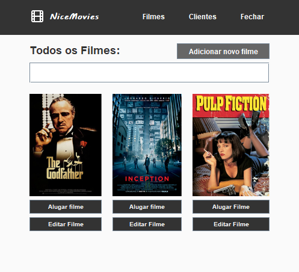
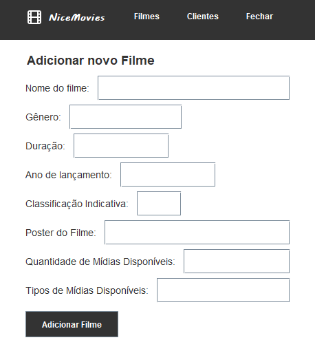
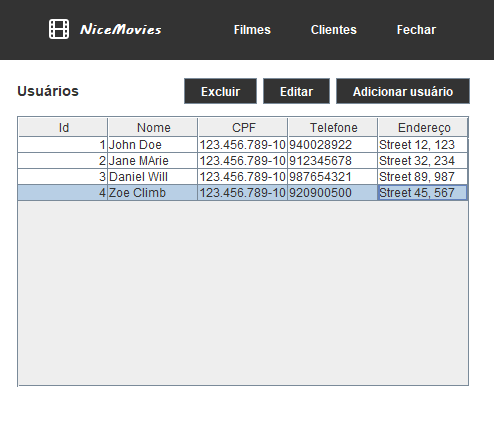

<h1 align="center">
  <h1 align="center">Locadora (telas)</h1>
</h1>

<h4 align="center">
  Telas de um sistema administrativo de uma Locadora de Filmes.
</h4>

  <a href="#Build with">Feito com</a>&nbsp;&nbsp;&nbsp;|&nbsp;&nbsp;&nbsp;
  <a href="#how-to-run">Como rodar</a>&nbsp;&nbsp;&nbsp;|&nbsp;&nbsp;&nbsp;
  <a href="#Screen">ScreenShots</a>&nbsp;&nbsp;&nbsp;|&nbsp;&nbsp;&nbsp;
  <a href="#License">Licença</a>&nbsp;&nbsp;&nbsp;|&nbsp;&nbsp;&nbsp;
  <a href="#Contact">Contato</a>&nbsp;&nbsp;&nbsp;|&nbsp;&nbsp;&nbsp;
  

  

<h2 id="Build with">:pencil2: Feito com</h2>

Este projeto foi construído com as tecnologias:

- Java
- Java GUI

<h2 id="how-to-run">:computer: Como rodar</h2>

Para rodar o projeto precisamos:

- Fazer download do projeto;
- Abrir o projeto no NetBeans;
- Rodar o arquivo main (F6).

<h2 id="Screen">:camera: Prints do Projeto</h2>

<h3>Tela de início:  </h3>
<h3>Adicionar filme:  </h3>
<h3>Registrar usuário:  </h3>
E mais...

<h2 id="License">:scroll: License</h2>

Este projeto está sob a licença MIT. Sinta-se à vontade para contribuir, fazer fork e usar este projeto como base para seus próprios projetos!

<h2 id="Contact">:telephone_receiver: License</h2>

- Acesse também meus outros repositórios no [Github](https://github.com/matheusfdosan?tab=repositories).

- Também me siga no [Instagram](https://instagram.com/matheusfdosan).

- Crie conexão comigo no [Linkedin](https://linkedin.com/in/matheusfaus).
